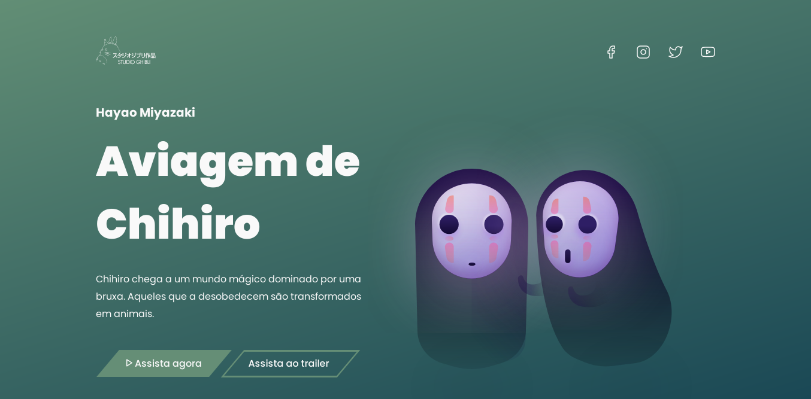

# One-Page 

      <a href="#-projeto">🖥 Projeto</a>&nbsp;&nbsp;&nbsp;|&nbsp;&nbsp;&nbsp;
      <a href="#-tecnologias">👨‍💻 Tecnologias</a>&nbsp;&nbsp;&nbsp;|&nbsp;&nbsp;&nbsp;
      <a href="#-executar-o-projeto">🖇 Execução do Projeto</a>&nbsp;&nbsp;&nbsp;|&nbsp;&nbsp;&nbsp;
      <a href="#-licença">📃 Licença</a>&nbsp;&nbsp;&nbsp;|&nbsp;&nbsp;&nbsp;

  

  
  ## 🖥 Projeto
  Projeto desenvolvido para fins de prática e desenvolvimento dos conhecimentos de HTML e CSS

  ## 👨‍💻 Tecnologias
  As tecnologias usadas nesse projeto foram:
  - [HTML](https://developer.mozilla.org/en-US/docs/Web/HTML)
  - [CSS](https://developer.mozilla.org/en-US/docs/Web/CSS)

  ## 🖇 Executar o Projeto
  Para executar o projeto <a href="https://ednaldo-byte.github.io/Login/">clique aqui</a>

  ##  📃 Licença
  Esse projeto possui licença MIT. Para mais detalhes consulte o arquivo [LICENSE](LICENSE.md)
 *
#dailyFrontend
*
